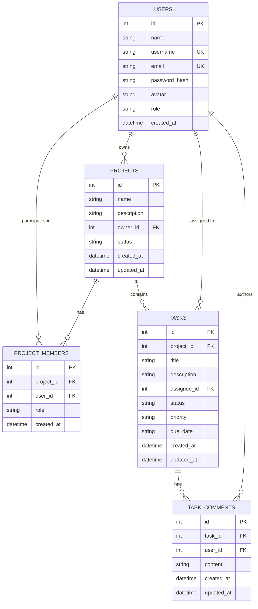

# CodeAlpha Task 3 — Project Management Application

A modern, high-performance, dark-first collaborative Project Management Web Application designed for agile teams, sprint tracking, project workspaces, and milestone execution.

Built with Vanilla JavaScript, HTML5, Tailwind CSS (via CDN), Node.js, Express.js, and native SQLite (`node:sqlite`).

---

## 👨‍💻 Developer Information

- **Developer Name:** Md. Tanjimul Islam
- **Internship:** CodeAlpha Web Development Internship
- **Task:** Task 3 — Project Management Application

---

## 🛠️ Technology Stack

| Layer | Technology | Details |
|---|---|---|
| **Frontend** | HTML5, Vanilla JavaScript | Semantic multi-page architecture |
| **Styling** | Tailwind CSS via CDN | Custom dark-first tokens (`#080B14`, `#111827`, `#27304A`, `#6366F1`) |
| **Icons** | Lucide Icons | Clean, modern SVG icons |
| **Backend** | Node.js, Express.js | RESTful API architecture |
| **Database** | SQLite (`node:sqlite`) | Native high-performance `DatabaseSync` persistence |
| **Authentication** | JWT & bcryptjs | Secure stateless tokens and salt-hashed passwords |

---

## ⚡ Node.js Compatibility

> [!IMPORTANT]
> This project uses Node.js native SQLite (`node:sqlite`), which requires **Node.js v22.0.0 or higher**.
> 
> Verify your installed version:
> ```bash
> node -v
> ```

---

## 📁 Directory Structure

```text
CodeAlpha_ProjectManagement/
├── frontend/
│   ├── index.html               # Dashboard overview (metrics, recent projects, upcoming tasks)
│   ├── projects.html            # Project listing with search & status filters
│   ├── project-details.html     # Deep dive into project milestones, members & tasks
│   ├── create-project.html      # Create new workspace form
│   ├── tasks.html               # Comprehensive task directory with priority & status filters
│   ├── profile.html             # User profile, owned workspaces & assigned deliverables
│   ├── login.html               # Sign in page with quick demo autofill
│   ├── register.html            # New user registration
│   │
│   ├── css/
│   │   └── style.css            # Custom CSS variables, scrollbars & shimmer animations
│   │
│   ├── js/
│   │   ├── api.js               # Centralized fetch client with JWT injection & error handling
│   │   ├── auth.js              # Authentication state, session handling & route guards
│   │   ├── ui.js                # Toasts, navbar rendering & Lucide initialization
│   │   ├── projects.js          # Project list rendering, filtering & search logic
│   │   ├── project-details.js   # Project details, team member rendering & task list
│   │   ├── tasks.js             # Global task table, status/priority filtering
│   │   └── profile.js           # User profile management & personal assignments
│   │
│   └── assets/                  # Static assets & media
│
├── backend/
│   ├── src/
│   │   ├── server.js            # Express application entry point & static file server
│   │   ├── database.js          # Native node:sqlite schema definition & query helpers
│   │   │
│   │   ├── middleware/
│   │   │   └── auth.js          # JWT verification & project authorization guards
│   │   │
│   │   └── routes/
│   │       ├── auth.js          # Register, Login, Me endpoints
│   │       ├── users.js         # User directory & profile update endpoints
│   │       ├── projects.js      # Project CRUD & Member invite/remove endpoints
│   │       └── tasks.js         # Task CRUD, Project task listing & Comments endpoints
│   │
│   ├── seed.js                  # Database seeding script with realistic project management data
│   ├── test_api.js              # Automated endpoint test runner
│   ├── package.json             # Backend dependencies & npm scripts
│   └── .env.example             # Template environment variables
│
└── README.md                    # Project documentation
```

---

## 🗄️ Database Design

The database schema is normalized and utilizes SQLite native foreign key constraints with WAL (Write-Ahead Logging) mode.



### Table Specifications

1. **`users`**
   - `id`: INTEGER PRIMARY KEY AUTOINCREMENT
   - `name`: TEXT NOT NULL
   - `username`: TEXT UNIQUE NOT NULL COLLATE NOCASE
   - `email`: TEXT UNIQUE NOT NULL COLLATE NOCASE
   - `password_hash`: TEXT NOT NULL (Never exposed via API)
   - `avatar`: TEXT DEFAULT ''
   - `role`: TEXT DEFAULT 'Member'
   - `created_at`: DATETIME DEFAULT CURRENT_TIMESTAMP

2. **`projects`**
   - `id`: INTEGER PRIMARY KEY AUTOINCREMENT
   - `name`: TEXT NOT NULL
   - `description`: TEXT DEFAULT ''
   - `owner_id`: INTEGER NOT NULL (FK -> `users(id)` ON DELETE CASCADE)
   - `status`: TEXT NOT NULL DEFAULT 'Active' (Check: `Active`, `Completed`, `Archived`)
   - `created_at`: DATETIME DEFAULT CURRENT_TIMESTAMP
   - `updated_at`: DATETIME DEFAULT CURRENT_TIMESTAMP
   - **Indexes**: `idx_projects_owner`

3. **`project_members`**
   - `id`: INTEGER PRIMARY KEY AUTOINCREMENT
   - `project_id`: INTEGER NOT NULL (FK -> `projects(id)` ON DELETE CASCADE)
   - `user_id`: INTEGER NOT NULL (FK -> `users(id)` ON DELETE CASCADE)
   - `role`: TEXT NOT NULL DEFAULT 'Member' (Check: `Owner`, `Admin`, `Member`)
   - `created_at`: DATETIME DEFAULT CURRENT_TIMESTAMP
   - **Unique Constraint**: `UNIQUE(project_id, user_id)` (Prevents duplicate membership)
   - **Indexes**: `idx_project_members_project`, `idx_project_members_user`

4. **`tasks`**
   - `id`: INTEGER PRIMARY KEY AUTOINCREMENT
   - `project_id`: INTEGER NOT NULL (FK -> `projects(id)` ON DELETE CASCADE)
   - `title`: TEXT NOT NULL
   - `description`: TEXT DEFAULT ''
   - `assignee_id`: INTEGER (FK -> `users(id)` ON DELETE SET NULL)
   - `status`: TEXT NOT NULL DEFAULT 'Todo' (Check: `Todo`, `In Progress`, `Completed`)
   - `priority`: TEXT NOT NULL DEFAULT 'Medium' (Check: `Low`, `Medium`, `High`)
   - `due_date`: TEXT DEFAULT ''
   - `created_at`: DATETIME DEFAULT CURRENT_TIMESTAMP
   - `updated_at`: DATETIME DEFAULT CURRENT_TIMESTAMP
   - **Indexes**: `idx_tasks_project`, `idx_tasks_assignee`, `idx_tasks_status`

5. **`task_comments`**
   - `id`: INTEGER PRIMARY KEY AUTOINCREMENT
   - `task_id`: INTEGER NOT NULL (FK -> `tasks(id)` ON DELETE CASCADE)
   - `user_id`: INTEGER NOT NULL (FK -> `users(id)` ON DELETE CASCADE)
   - `content`: TEXT NOT NULL
   - `created_at`: DATETIME DEFAULT CURRENT_TIMESTAMP
   - `updated_at`: DATETIME DEFAULT CURRENT_TIMESTAMP
   - **Indexes**: `idx_task_comments_task`

---

## 🔒 Security & Authorization Rules

The backend strictly enforces multi-tenant project security on every endpoint:
1. **Never Trust Client User IDs**: User identification is extracted exclusively from the cryptographically verified JWT payload (`req.user.id`).
2. **Project Access Control**: Non-members cannot view project details, project tasks, or member directories.
3. **Project Mutation Control**: Only project Owners or Admins can edit project metadata or delete workspaces.
4. **Member Validation**: Users can only be assigned to tasks if they are confirmed members of that specific project.
5. **Comment Ownership**: Users can only delete or modify comments that they personally authored.
6. **SQL Injection Prevention**: All queries use parameterized prepared statements (`db.prepare()`).
7. **Credential Protection**: Passwords are encrypted with `bcryptjs` (salt rounds: 10) and `password_hash` is stripped from all user responses.

---

## 🌐 API Reference

### Authentication Endpoints
- `POST /api/auth/register` — Register a new account
- `POST /api/auth/login` — Login and receive JWT token
- `GET /api/auth/me` — Retrieve currently authenticated user profile

### Project Endpoints
- `GET /api/projects` — List all projects user owns or participates in (Supports `?status=` and `?search=`)
- `GET /api/projects/:id` — Get single project with members and task statistics
- `POST /api/projects` — Create a new project (Creator is auto-assigned as Owner)
- `PUT /api/projects/:id` — Update project metadata (Owner/Admin only)
- `DELETE /api/projects/:id` — Delete project (Owner only)
- `POST /api/projects/:id/members` — Invite user to project (Owner/Admin only)
- `DELETE /api/projects/:id/members/:userId` — Remove user from project (Owner/Admin only)

### Task Endpoints
- `GET /api/tasks` — List tasks with filters (`?assigned=me`, `?status=`, `?priority=`)
- `GET /api/projects/:projectId/tasks` — List all tasks belonging to a specific project
- `POST /api/projects/:projectId/tasks` — Create new task in project (Validates assignee membership)
- `GET /api/tasks/:id` — Get task details
- `PUT /api/tasks/:id` — Update task status, priority, title, or assignee
- `DELETE /api/tasks/:id` — Delete task (Project Owner, Admin, or Task Creator)

### Comment Endpoints
- `GET /api/tasks/:id/comments` — List all comments on a task
- `POST /api/tasks/:id/comments` — Post a new comment on a task
- `DELETE /api/comments/:id` — Delete a comment (Author only)

---

## 🔑 Demo Account Credentials

Use the pre-seeded demo account for immediate access:

- **Email:** `demo@codealpha.com`
- **Password:** `password123`
- **Role:** Admin / Workspace Owner
- **Name:** Md. Tanjimul Islam

---

## 🚀 Setup & Execution Guide

### 1. Install Dependencies
Navigate to the backend directory:
```bash
cd CodeAlpha_ProjectManagement/backend
npm install
```

### 2. Configure Environment Variables
Copy the `.env.example` file to `.env`:
```bash
cp .env.example .env
```
Default values:
```env
PORT=5002
JWT_SECRET=codealpha_task3_jwt_secret_key_2026_super_secure
DATABASE_PATH=projectmanagement.db
```

### 3. Seed the Database
Populate demo users, workspaces, tasks, and comments:
```bash
npm run seed
# or
node seed.js
```

### 4. Start the Application
```bash
npm start
# or
node src/server.js
```

The application will be accessible at:
👉 **`http://localhost:5002`**

### 5. Run Automated API Tests
To verify all REST endpoints and security validations:
```bash
npm test
# or
node test_api.js
```

---

## 🎨 UI/UX Design System

- **Background:** `#080B14` (Deep navy midnight)
- **Surface:** `#111827` (Rich slate card surface)
- **Elevated:** `#151B2D` (Highlighted interaction background)
- **Border:** `#27304A` (Subtle perimeter divider)
- **Primary Brand:** `#6366F1` (Indigo accent)
- **Hover:** `#818CF8`
- **Success:** `#34D399` (Mint emerald for completed items)
- **Warning:** `#FBBF24` (Amber for upcoming deadlines)
- **Error:** `#FB7185` (Coral red for high priority / alerts)
- **Typography:** `Plus Jakarta Sans`
- **Icons:** Lucide Icons (SVG)
