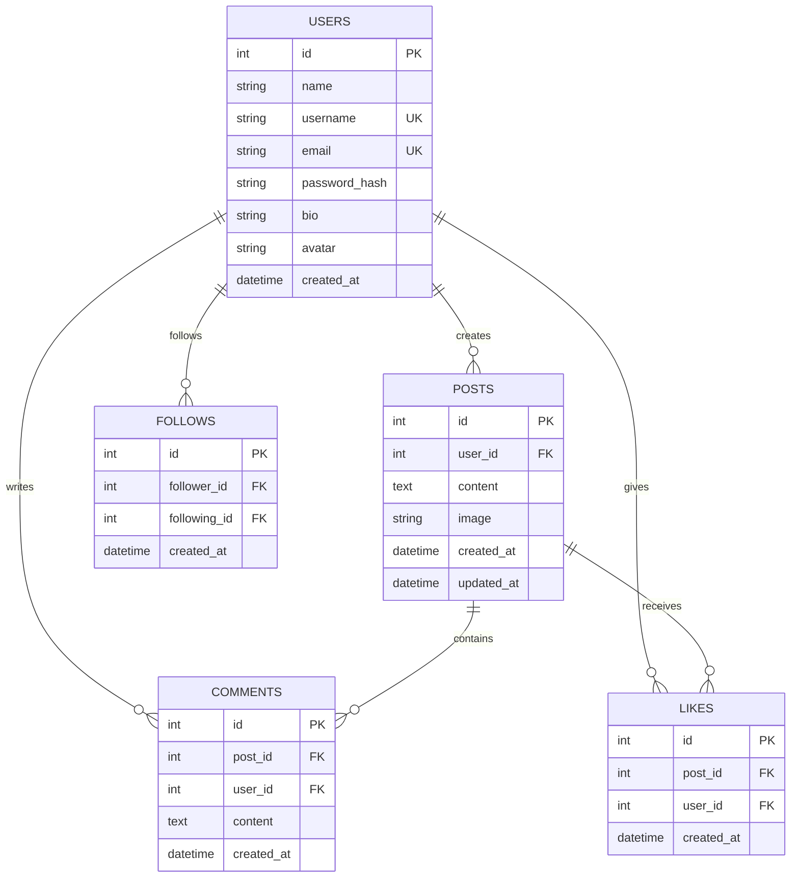

# CodeAlpha Task 2 — Social Media Platform

A modern, responsive, dark-first **Social Media Platform** built as part of the **CodeAlpha Full Stack Development Internship** (Task 2) by **Md. Tanjimul Islam**.

The platform enables users to create profiles, publish posts with optional imagery, like and comment on community updates, follow peer developers, and browse a paginated real-time stream.

---

## 1. Features Overview

- **User Authentication**: Secure user registration and login powered by JSON Web Tokens (JWT) and `bcryptjs` salted password hashing.
- **Developer Profiles**: Dedicated profile pages (`profile.html?u=username`) featuring user avatars, bios, joined timestamps, post counts, and follower/following statistics.
- **Post Stream & Publishing**: Create updates with character counting (up to 2,000 characters) and optional media image previews.
- **Server-Side Feed Pagination**: Protected feed queries with configurable limits (default 10, max 50) and page offsets (`/api/posts?page=1&limit=10`).
- **Likes & Micro-Interactions**: Idempotent post liking and unliking with animated heart pop feedback and instant counters.
- **Interactive Comments**: Add constructive reactions to posts with live counts and ownership-restricted comment deletion.
- **Follow Network**: Follow and unfollow creators with prevention of self-following and duplicate follows.
- **Strict Backend Authorization**: Explicit server-side ownership checks ensure users can only modify or delete their own posts and comments (User B attempting to delete User A's post returns `403 Forbidden`).
- **Unified Dark-First Design System**: Cohesive slate and navy visual language (`#080B14`, `#111827`, `#27304A`) with vibrant indigo accents (`#6366F1`) matching the CodeAlpha project family.

---

## 2. Technology Stack

### Frontend
- **HTML5**: Semantic document structure.
- **Vanilla JavaScript (ES6+)**: Modular client logic without external frontend frameworks.
- **Tailwind CSS via CDN**: Utility-first styling with responsive grid layouts.
- **Lucide SVGs**: Consistent, accessible iconography.

### Backend
- **Node.js**: Asynchronous JavaScript runtime environment.
- **Express.js**: RESTful HTTP API routing and static asset serving.
- **SQLite via `node:sqlite`**: Fast, lightweight embedded database engine running in WAL mode with foreign key enforcement.
- **bcryptjs**: Cryptographic password hashing (10 salt rounds).
- **jsonwebtoken**: Stateless JWT session authentication.
- **CORS & Dotenv**: Cross-origin policy and configuration management.

---

## 3. Node.js Compatibility Notice

> [!IMPORTANT]
> **Required Node.js Version**: **Node.js >= 22.0.0** (Verified on `v22.16.0`).
> This project utilizes Node.js's native embedded SQLite module (`node:sqlite` / `DatabaseSync`), eliminating the need for Python or native C++ build tools (`node-gyp`).

To verify your Node.js version:
```bash
node -v
```

---

## 4. Project Structure

```
CodeAlpha_SocialMedia/
│
├── frontend/
│   ├── index.html            # Main Feed & quick post publisher
│   ├── profile.html          # Profile view, stats & edit modal
│   ├── post-details.html     # Focused post details & comments stream
│   ├── create-post.html      # Dedicated post creation page with preview
│   ├── login.html            # Dark authentication card with demo autofill
│   ├── register.html         # User registration with password validation
│   ├── css/
│   │   └── style.css         # Dark tokens, animations & skeleton shimmer
│   └── js/
│       ├── api.js            # Centralized API fetch wrapper & dark toasts
│       ├── auth.js           # JWT state management & dynamic navbar
│       ├── feed.js           # Post stream, pagination & like toggling
│       ├── profile.js        # Profile loader, follow actions & profile editor
│       ├── post.js           # Create post, comments management & details
│       └── ui.js             # SVG icon helpers & relative time formatter
│
├── backend/
│   ├── src/
│   │   ├── server.js         # Express entry point & error handlers
│   │   ├── database.js       # SQLite tables, indexes & connection
│   │   ├── middleware/
│   │   │   └── auth.js       # JWT verification & optional auth middleware
│   │   └── routes/
│   │       ├── auth.js       # Register, Login, Me endpoints
│   │       ├── users.js      # User profiles & profile updates
│   │       ├── posts.js      # CRUD posts, pagination & post likes
│   │       ├── comments.js   # Create & delete comments
│   │       └── follows.js    # Follow, unfollow & follower lists
│   │
│   ├── seed.js               # Seed script (10 users, 20 posts, 32 comments, likes & follows)
│   ├── test_api.js           # Automated test suite (22 tests)
│   ├── package.json          # Node dependencies and project metadata
│   └── .env.example          # Environment variables template
│
└── README.md                 # Complete documentation
```

---

## 5. Database Schema & Tables

Foreign keys are strictly enforced on all queries (`PRAGMA foreign_keys = ON;`).



---

## 6. REST API Endpoints

### Authentication
- `POST /api/auth/register` — Register a new account (`name`, `username`, `email`, `password`).
- `POST /api/auth/login` — Authenticate with email/username and password; returns JWT.
- `GET /api/auth/me` — Retrieve currently authenticated user profile.

### User Profiles & Follow Network
- `GET /api/users/:username` — Retrieve user profile with follower, following, and post counts.
- `GET /api/users/suggestions` — Retrieve recommended creators to follow.
- `PUT /api/users/profile` — Update name, bio, and avatar for the authenticated user.
- `POST /api/users/:id/follow` — Follow a creator (prevents self-follow and duplicates).
- `POST /api/users/:id/unfollow` — Unfollow a creator.
- `GET /api/users/:id/followers` — List users following this creator.
- `GET /api/users/:id/following` — List creators followed by this user.

### Posts & Likes
- `GET /api/posts` — Retrieve paginated feed (`page`, `limit` [10–50], `feed` [all/following], `search`, `user`).
- `GET /api/posts/:id` — Retrieve a single post with author information and counts.
- `POST /api/posts` — Publish a new post (`content`, `image`).
- `PUT /api/posts/:id` — Edit an authored post (requires post ownership).
- `DELETE /api/posts/:id` — Delete an authored post (requires post ownership).
- `POST /api/posts/:id/like` — Like a post (idempotent; prevents duplicate likes).
- `DELETE /api/posts/:id/like` — Unlike a post.
- `GET /api/posts/:id/likes` — List users who liked the post.

### Comments
- `GET /api/posts/:id/comments` — Retrieve chronological comments for a post.
- `POST /api/posts/:id/comments` — Add a comment to a post (`content`).
- `DELETE /api/comments/:id` — Delete an authored comment (strictly restricted to author).

---

## 7. Setup & Installation

### Step 1: Navigate to the backend directory
```bash
cd CodeAlpha_SocialMedia/backend
```

### Step 2: Install dependencies
```bash
npm install
```

### Step 3: Populate database with realistic seed data
```bash
npm run seed
```
*Creates 10 users, 20 posts, 32 comments, 35 likes, and 20 follow relationships.*

### Step 4: Run automated test suite
```bash
npm test
```
*Executes 22 automated API and ownership security tests.*

### Step 5: Start the backend server
```bash
npm start
```
The server will start on port `5001`.

### Step 6: Open the frontend
Open your web browser and navigate to:
```
http://localhost:5001/index.html
```

---

## 8. Demo Credentials

| Role | Email | Password | Username |
| :--- | :--- | :--- | :--- |
| **Demo Account** | `demo@codealpha.com` | `password123` | `@demo_user` |
| **Sarah Jenkins** | `sarah.jenkins@example.com` | `password123` | `@sarah_j` |
| **Marcus Vance** | `marcus.vance@example.com` | `password123` | `@marcus_v` |

---

## 9. Automated Testing

The backend includes a comprehensive automated test suite in `backend/test_api.js`:
- Tests all 22 required functional endpoints.
- Verifies duplicate email and duplicate username rejection.
- Validates token generation and expiration handling.
- Verifies server-side feed pagination.
- Verifies duplicate like and duplicate follow prevention.
- Validates cross-user ownership security:
  - User B attempting to delete User A's post returns `403 Forbidden`.
  - User A attempting to delete User B's comment returns `403 Forbidden`.

To execute the test suite:
```bash
cd CodeAlpha_SocialMedia/backend
node test_api.js
```

---

## 10. Developer Credit

- **Developer**: Md. Tanjimul Islam
- **Internship**: CodeAlpha Full Stack Development Internship
- **Task**: Task 2 — Social Media Platform
